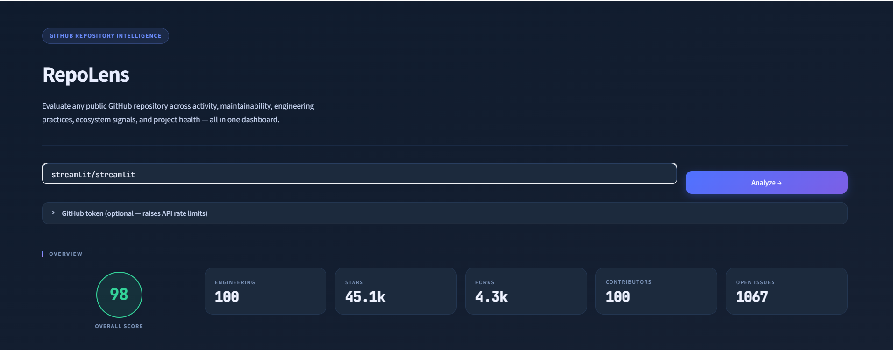
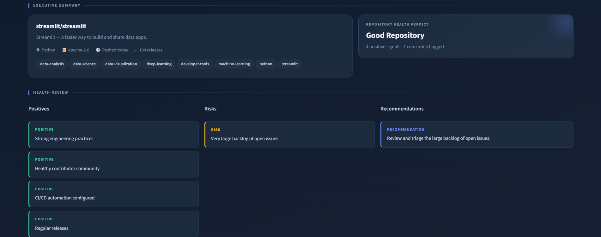
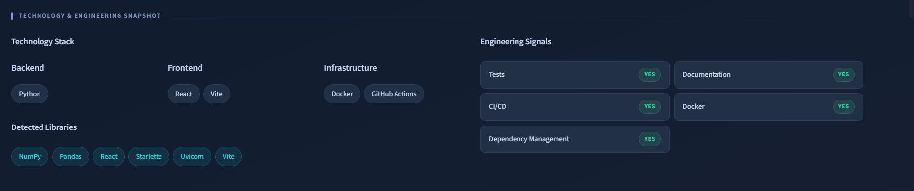
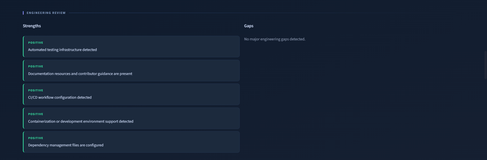
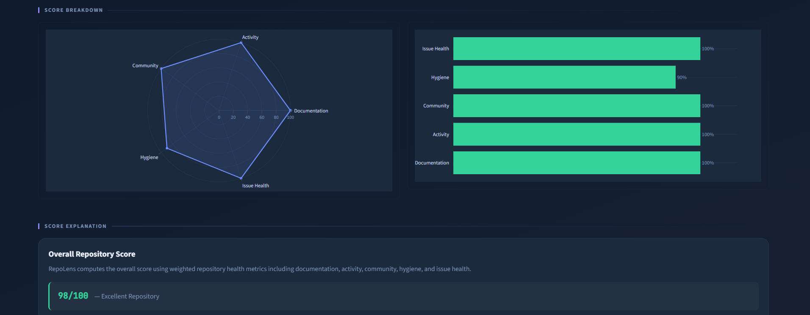
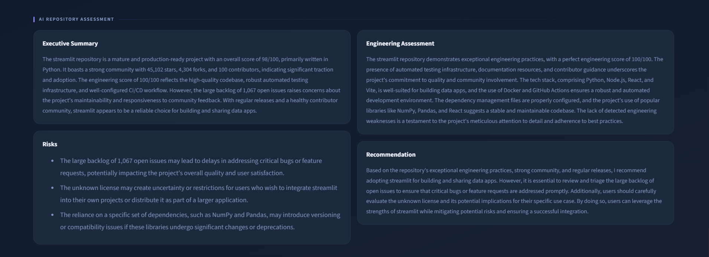

# 🔭 RepoLens

> **AI-Powered GitHub Repository Intelligence**

Analyze any public GitHub repository to evaluate engineering quality, repository health, technology stack, maintainability, and project maturity through an interactive dashboard powered by GitHub APIs and Groq AI.

---

## ✨ Overview

RepoLens is an AI-powered repository analysis platform that provides a comprehensive health assessment for public GitHub repositories.

Instead of relying solely on GitHub statistics such as stars and forks, RepoLens evaluates engineering maturity, development practices, documentation quality, repository activity, project hygiene, and overall maintainability. It combines heuristic analysis with Large Language Models (Groq) to generate actionable engineering insights.

Whether you're a developer evaluating an open-source project, a recruiter reviewing candidate repositories, or an engineering team assessing software quality, RepoLens provides an informative and easy-to-understand repository review.

---

# ✨ Features

* 📊 Overall Repository Quality Score
* ⚙ Engineering Maturity Assessment
* 🧠 AI-Generated Executive Summary
* 📈 Interactive Plotly Visualizations
* 📦 Technology Stack Detection
* 🔍 Dependency Detection
* 📚 Documentation Analysis
* 🧪 Test & CI/CD Detection
* 🐳 Docker & Infrastructure Detection
* 💡 Actionable Engineering Recommendations
* ⚠ Repository Risk Assessment
* ⭐ GitHub Repository Statistics
* 🏷 Repository Health Verdict

---

# 📸 Screenshots

## Dashboard Overview

<p align="center">

</p>

---

## Repository Summary

<p align="center">

</p>

---

## Technology & Engineering Snapshot

<p align="center">

</p>

---

## Engineering Review

<p align="center">

</p>

---

## Score Breakdown

<p align="center">

</p>

---

## AI Repository Assessment

<p align="center">

</p>

---

# 🏗 Architecture

```
                    User
                      │
                      ▼
             Streamlit Dashboard
                      │
                      ▼
             Repository Analyzer
                      │
      ┌───────────────┼────────────────┐
      │               │                │
      ▼               ▼                ▼
 GitHub API     Scoring Engine   Technology Detection
      │               │                │
      └───────────────┼────────────────┘
                      │
                      ▼
            Engineering Analysis
                      │
                      ▼
                Groq AI Review
                      │
                      ▼
            Interactive Dashboard
```

---

# ⚙ How RepoLens Works

1. The user enters a public GitHub repository.
2. RepoLens retrieves repository metadata using the GitHub REST API.
3. Repository quality metrics are calculated across multiple categories.
4. Engineering practices such as testing, CI/CD, Docker support, and dependency management are detected.
5. Technologies and project dependencies are identified.
6. Repository strengths, weaknesses, and recommendations are generated.
7. Groq AI produces an executive summary, engineering assessment, risk analysis, and recommendation.
8. Results are presented through an interactive dashboard.

---

# 📊 Repository Scoring

RepoLens evaluates repositories across five weighted categories.

| Category             | Weight |
| -------------------- | ------ |
| Documentation        | 25%    |
| Repository Activity  | 25%    |
| Community Engagement | 20%    |
| Project Hygiene      | 20%    |
| Issue Health         | 10%    |

The Engineering Score evaluates additional engineering practices including:

* Documentation
* Automated Testing
* CI/CD Pipelines
* Docker Support
* Dependency Management

---

# 🧠 AI Analysis

RepoLens uses Groq LLMs to generate:

* Executive Summary
* Engineering Assessment
* Repository Risks
* Actionable Recommendations

The AI analysis is grounded in repository metadata and engineering signals extracted during analysis.

---

# 🛠 Tech Stack

| Component     | Technology      |
| ------------- | --------------- |
| Language      | Python          |
| Frontend      | Streamlit       |
| Visualization | Plotly          |
| AI            | Groq            |
| APIs          | GitHub REST API |
| Styling       | Custom CSS      |

---

# 📂 Project Structure

```
RepoLens
│
├── app.py
├── streamlit_app.py
├── charts.py
├── ui_components.py
├── github_api.py
├── scoring.py
├── engineering.py
├── ai_summary.py
├── config.py
├── style.css
├── requirements.txt
│
├── assets/
│   ├── dashboard.png
│   ├── overview.png
│   ├── summary.png
│   ├── technology.png
│   ├── engineering.png
│   ├── charts.png
│   └── ai-review.png
│
└── README.md
```

---

# 🚀 Installation

```bash
git clone https://github.com/<your-username>/RepoLens.git

cd RepoLens

pip install -r requirements.txt

streamlit run streamlit_app.py
```

---

# 💻 Usage

1. Launch the Streamlit application.
2. Enter a public GitHub repository (e.g. `streamlit/streamlit`).
3. Optionally provide a GitHub Personal Access Token for higher API limits.
4. Click **Analyze**.
5. Explore the generated repository insights and AI assessment.

---

# 🔮 Future Improvements

* Repository comparison mode
* PDF report export
* Historical repository tracking
* Private repository analysis
* Security-focused repository checks

---

# 🤝 Contributing

Contributions, feature requests, and suggestions are welcome.

If you find a bug or have an idea for improvement, feel free to open an issue or submit a pull request.

---

# 📄 License

This project is licensed under the MIT License.
